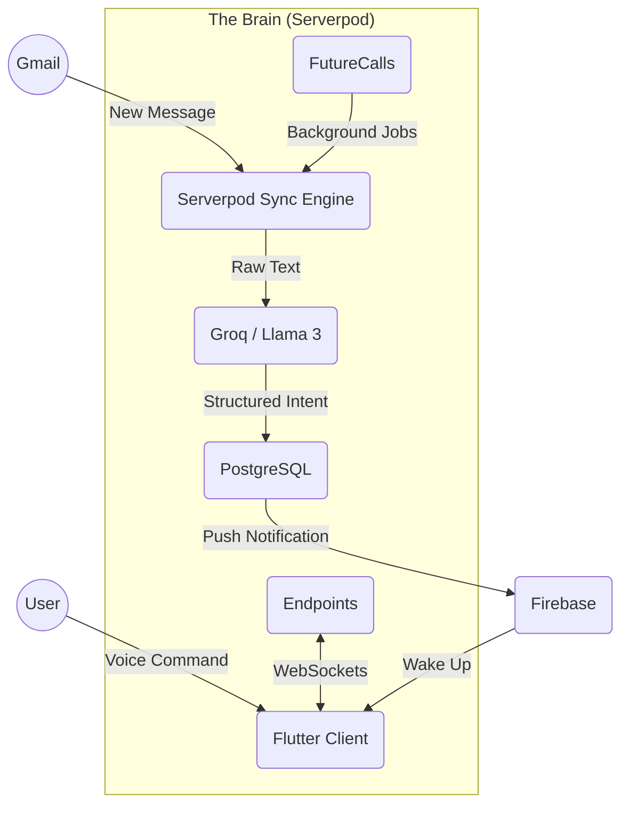

# Recall: The Intelligent Flutter Butler 🤖✨

> **"Your memory, upgraded."**

**Recall** is an agentic personal relationship manager designed to act as your proactive digital butler. It doesn't just store your to-do list; it actively listens to your voice, watches your inbox, and organizes your life using advanced AI.

---

## 🧐 The Problem
We live in a stream of noise.
*   **Context Switching**: Moving between Gmail, Calendar, and Notes apps kills productivity.
*   **Passive Tools**: Traditional apps wait for you to input data. They don't *help* untill you do the work.
*   **Data Silos**: Your email knows you have a meeting, but your calendar doesn't know *why* that meeting is important.

## 💡 The Solution: Recall
Recall connects these silos into a single, intelligent timeline. It uses **Serverpod** as a brain to process data in the background and **Groq AI** to understand human intent instantly.

---

## 🏗️ Technical Architecture

Recall is a showcase of a modern **Dart Full Stack**.

### High-Level Data Flow


### 1. The Backend (Serverpod)
The heart of Recall is a **Serverpod** monolith that handles:
*   **Authentication**: We use `serverpod_auth` to handle Google Sign-In securely. Session tokens are managed automatically.
*   **Database (ORM)**: All data models (`AgendaItem`, `ChatMessage`, `Contact`) are defined in `.spy.yaml` files. Serverpod generates the SQL migrations and Dart classes automatically.
    *   *Example*: Querying "High Priority" tasks is type-safe: `AgendaItem.db.find(session, where: (t) => t.priority.equals(Priority.high))`
*   **Future Calls (The Sync Engine)**: This is critical. To avoid blocking the UI, we use `GmailSyncFutureCall`. This is a scheduled background job that:
    1.  Wakes up every 15 minutes.
    2.  Fetches new emails via Gmail API.
    3.  Runs them through **Groq AI** to see if they are "Actionable".
    4.  If actionable, it creates an `AgendaItem` and pushes it to the client.

### 2. The AI Layer (Groq & Llama 3)
We moved from traditional APIs to **Groq** for its blistering speed (~300 tokens/sec).
*   **Intent Recognition**: When a user speaks, we send the transcript to Groq. 
    *   *Input*: "Meet Alex tomorrow for coffee." 
    *   *Output JSON*: `{"action": "create_event", "who": "Alex", "time": "2024-02-01T10:00:00"}`.
*   **RAG (Retrieval Augmented Generation)**: When you ask "What did Alex say about the project?", we vector-search your past emails and feed the context to Llama 3 to generate a precise answer.

### 3. The Frontend (Flutter)
A Reactive, "Voice-First" UI.
*   **State Management**: `Riverpod` manages the application state.
*   **Offline First**: We use **Hive** to cache agenda items locally. You can view your schedule even on an airplane.
*   **Voice Processing**: We use `speech_to_text` for on-device recognition, ensuring immediate feedback before sending data to the server.

---

## ✨ Key Features & Capabilities

### 🗣️ Voice Command Center
Recall's primary interface is your voice.
*   **Natural Language Processing**: You don't need to speak like a robot. "Remind me to buy milk" and "I need milk, add it to the list" result in the same structured task.
*   **Context Awareness**: If you say "Call him back", Recall knows you are looking at Alex's profile and links the task to *him*.

### 📧 Intelligent Gmail Sync
Recall is your email filter.
*   **Noise Cancellation**: It ignores newsletters, OTPs, and receipts.
*   **Entity Extraction**: It spots dates ("Next Tuesday") and converts them into actual timestamps in your calendar.

### � Privacy & Security
*   **Data Ownership**: You host the Serverpod instance. Your data lives in your PostgreSQL database, not in some proprietary cloud.
*   **Secret Management**: API Keys are stored in `.env` files and never exposed to the client.

---

## 🛠️ Installation & Setup Manual

### Prerequisites
1.  **Dart SDK** (>= 3.0) & **Flutter SDK** (>= 3.19)
2.  **Docker Desktop** (Required for Postgres & Redis)
3.  **Google Cloud Console Account** (For Gmail API & OAuth)
4.  **Groq API Key** (For AI Intelligence)

### Step 1: Clone & Configure
```bash
git clone https://github.com/jithendra-10/Recall-main.git
cd Recall-main
```

### Step 2: Secret Management
Create a `.env` file in the root directory.
```env
# AI Provider
GROQ_API_KEY=gsk_...

# Google OAuth (Create in Google Cloud Console)
GOOGLE_CLIENT_ID=...
GOOGLE_CLIENT_SECRET=...

# Server Config
SERVER_URL=http://localhost:8080/
DATABASE_PASSWORD=...
```
*Note: Copy this `.env` to `recall_server/config/` and `recall_flutter/assets/` if you are not using a deployment script.*

### Step 3: Launch Local Backend
1.  **Start Databases**:
    ```bash
    cd recall_server
    docker-compose up -d --build
    ```
2.  **Apply Migrations**:
    ```bash
    dart bin/main.dart --apply-migrations
    ```
3.  **Start Server**:
    ```bash
    dart bin/main.dart
    ```

### Step 4: Run Mobile App
```bash
cd recall_flutter
flutter run
```

---

## 📂 Codebase Structure

*   **/recall_server**
    *   `lib/src/endpoints`: **API Layer**. Contains `RecallEndpoint.dart` methods callable from Flutter.
    *   `lib/src/future_calls`: **Background Workers**. `GmailSyncFutureCall.dart` lives here.
    *   `lib/src/models`: **Database Schema**. Defined in yaml, compiled to Dart.
*   **/recall_flutter**
    *   `lib/src/features/dashboard`: **UI Logic**. The main timeline view.
    *   `lib/src/features/voice`: **Audio Logic**. Handling microphone streams.

---

## 🏆 Hackathon Context

This project was built for the **Serverpod Hackathon**.
*   **Goal**: To demonstrate how Serverpod can power "Agentic" workflows that run independently of the user.
*   **Achievement**: We successfully built a system that manages relationships and tasks autonomously using Future Calls and Generative AI.

---

**Recall** - *Don't just remember. Recall.*
