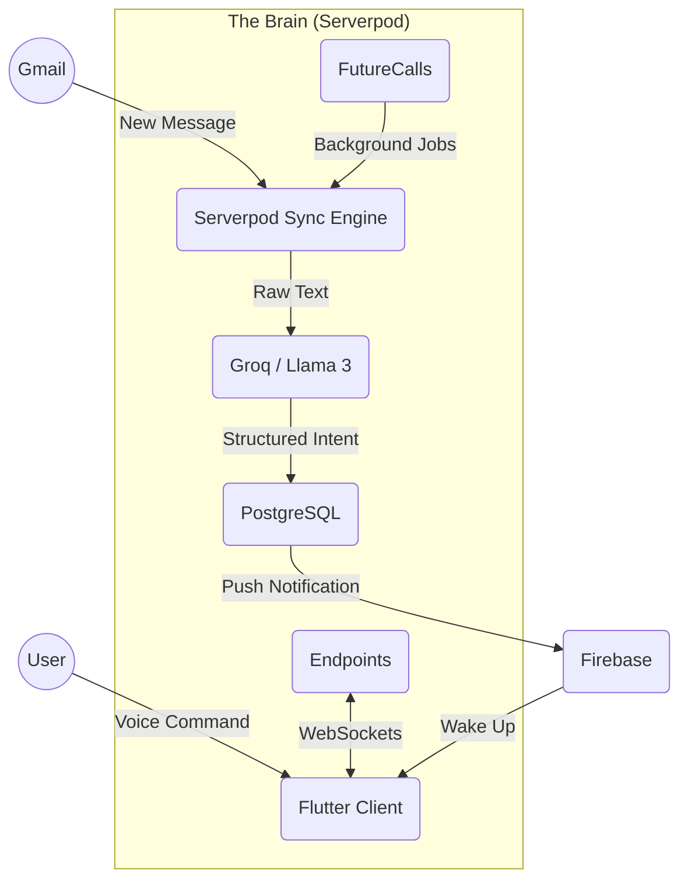

# Recall: The Intelligent Flutter Butler 🤖✨

> **"Your digital life, proactively managed by an Agentic AI."**

---

## 📖 Table of Contents
1.  [Executive Summary](#-executive-summary)
2.  [The Problem Statement](#-the-problem-statement)
3.  [The Solution: Agentic Architecture](#-the-solution-agentic-architecture)
4.  [Technical Deep Dive](#-technical-deep-dive)
    *   [Backend: The Power of Serverpod](#backend-the-power-of-serverpod)
    *   [Artificial Intelligence: Groq & Llama 3](#artificial-intelligence-groq--llama-3)
    *   [Frontend: Flutter & Riverpod](#frontend-flutter--riverpod)
5.  [Key Features In-Depth](#-key-features-in-depth)
6.  [Installation & Deployment Manual](#-installation--deployment-manual)
7.  [Future Roadmap](#-future-roadmap)

---

## 🧐 Executive Summary

**Recall** is not simply a task management application; it is an **Autonomous Personal Relationship Manager**. It acts as a proactive digital "Butler" that creates order from the chaos of modern digital communication. 

Unlike traditional tools that act as passive data stores—waiting for you to input tasks manually—Recall works in the background. It connects to your personal data streams (starting with **Gmail**), analyzes them using **Large Language Models (LLMs)**, and constructs a unified, intelligent agenda of your life.

Built for the **Serverpod Hackathon**, Recall demonstrates how Dart can be used for the entire stack: from the pixel-perfect mobile UI (Flutter) to the robust, scalable backend (Serverpod), all communicating via a type-safe generated protocol.

---

## � The Problem Statement

Modern professionals face a crisis of **Context Switching** and **Data Fragmentation**.

*   **The Inbox Trap**: Your "To-Do" list is often buried inside your email inbox. You read an email, mentally note a task, and then it gets buried by ten new newsletters.
*   **Passive Tools**: Calendar apps know *when* a meeting is, but they don't know *what* it's about or *who* you are meeting. They lack context.
*   **The "Entry" Tax**: The friction of manually entering a task into a mobile app is high. If it takes more than 5 seconds, you won't do it.

---

## 💡 The Solution: Agentic Architecture

Recall solves these problems by inverting the relationship. Instead of you serving the app, the app serves you.

### High-Level Data Flow

The system is designed as a **Hub-and-Spoke** model with Serverpod at the center.



1.  **Ingestion**: Serverpod runs "Future Calls" (background jobs) to periodically fetch data from Gmail.
2.  **Cognition**: Data is sent to **Groq** (running Llama 3-70b) to determine "Intent". Is this spam? Is this a meeting request? Is this a bill?
3.  **Action**: If an intent is found, Serverpod creates a structured database record (`AgendaItem`) and notifies the user via Firebase Cloud Messaging (FCM).

---

## 🛠 Technical Deep Dive

### Backend: The Power of Serverpod

We chose **Serverpod** essentially for its "Superpowers" in three specific areas:

#### 1. Future Calls (The "Heartbeat")
Background processing is notoriously difficult in mobile app backends. Serverpod makes it trivial. We implemented `GmailSyncFutureCall`, a persistent worker that:
*   Wakes up on a schedule.
*   Authenticates with Google using stored refresh tokens.
*   Processes batches of emails asynchronously.
*   **Benefit**: The user's phone handling zero processing load. The battery is saved, yet the data is always fresh.

#### 2. The Type-Safe Protocol (The "Nervous System")
One of the biggest sources of bugs in full-stack development is the API mismatch (e.g., the server sends `user_id`, but the client expects `userId`).
*   With Serverpod, we defined our models in `.spy.yaml` files.
*   Serverpod **generated** the client-side Dart code automatically.
*   **Benefit**: If we changed a database field on the server, the Flutter app would fail to *compile* immediately, alerting us to the break before we even ran the app.

#### 3. Built-in Authentication
*   We utilized the `serverpod_auth` module to handle the complex OAuth2 flows required for Google Sign-In.
*   Session management, token refresh, and user security were handled out-of-the-box, saving us weeks of boilerplate development.

### Artificial Intelligence: Groq & Llama 3

We abandoned traditional proprietary models (like GPT-4) in favor of **Groq** running open-source models (Llama 3).

*   **Why Groq?** Speed. Groq's LPU (Language Processing Unit) architecture delivers **~300 tokens per second**. 
*   **The User Experience**: When a user speaks a voice command, they expect an instant response. Waiting 5 seconds for GPT-4 is unacceptable. with Groq, the response is effectively real-time.
*   **Prompt Engineering**: We use "System Prompts" to force the LLM to output strict JSON. This allows our Serverpod backend to parse the AI's response directly into Dart objects without fragile regex parsing.

### Frontend: Flutter & Riverpod

The mobile application is the "Interface" to the Agent.
*   **Voice-First Design**: The UI features a prominent microphone button. We use `speech_to_text` for on-device transcription to ensure privacy and low latency.
*   **Offline-First**: We use **Hive** (a NoSQL local database) to mirror the Serverpod data using the `AgendaItem` models. This ensures the user can view their schedule even without an internet connection.
*   **Riverpod**: Used for dependency injection and state management, keeping our UI logic separate from the Serverpod client logic.

---

## 🔍 Key Features In-Depth

### 🗣️ Voice Command Center
*   **Natural Language Understanding**: You can say complex things like *"I need to meet John next Tuesday at 4 PM to discuss the Q3 roadmap."*
*   **Entity Extraction**: The AI extracts:
    *   **Who**: "John" (Links to Contact ID #124)
    *   **When**: "Next Tuesday at 4 PM" (Calculates ISO8601 Timestamp)
    *   **What**: "Discuss Q3 roadmap" (Sets as Title/Description)

### 📧 Intelligent Context & RAG
Recall implements a basic **RAG (Retrieval Augmented Generation)** system.
*   When you view a contact, Recall fetches the last 5 emails and summary notes associated with them.
*   The AI generates a "Relationship Summary", reminding you of deadlines, promises you made, or unanswered questions.

---

## � Installation & Deployment Manual

Follow these steps to deploy your own instance of Recall.

### Prerequisites
*   **Dart SDK**: Version 3.0 or higher.
*   **Flutter SDK**: Version 3.19 or higher.
*   **Docker Desktop**: Essential for running the PostgreSQL database and Redis cache.
*   **Groq API Key**: Get one from [console.groq.com](https://console.groq.com).

### 1. Repository Setup
```bash
git clone https://github.com/jithendra-10/Recall-main.git
cd Recall-main
```

### 2. Secrets Management
Security is paramount. We do not hardcode keys. Create a `.env` file in the root (`/`) directory.

```env
# AI Intelligence Provider
GROQ_API_KEY=gsk_your_key_here

# Google Cloud Console (OAuth 2.0 Credentials)
GOOGLE_CLIENT_ID=your_client_id.apps.googleusercontent.com
GOOGLE_CLIENT_SECRET=your_client_secret

# Server Configuration
SERVER_URL=http://localhost:8080/
DATABASE_PASSWORD=postgres_password_here
```

### 3. Backend Initialization
The backend relies on Docker containers for persistence.

1.  **Launch Containers**:
    ```bash
    cd recall_server
    docker-compose up -d --build
    ```
2.  **Apply Database Schema**:
    This command connects to Postgres and creates the tables defined in our Protocol.
    ```bash
    dart bin/main.dart --apply-migrations
    ```
3.  **Start the Server**:
    ```bash
    dart bin/main.dart
    ```

### 4. Client Launch
Open a new terminal tab.
```bash
cd recall_flutter
flutter run
```

---

## � Future Roadmap

Recall is just getting started. Here is our vision for V2:
*   **WearOS Integration**: A dedicated watch app for quick voice capture on the go.
*   **Calendar Bi-Directional Sync**: Currently we read from Gmail; next we will write back to Google Calendar.
*   **Local LLM Support**: Running Llama 3 8B directly on the user's device (Pixel/iPhone) for total privacy and zero latency.

---

*Recall was proudly built with Dart, Flutter, and Serverpod.*
